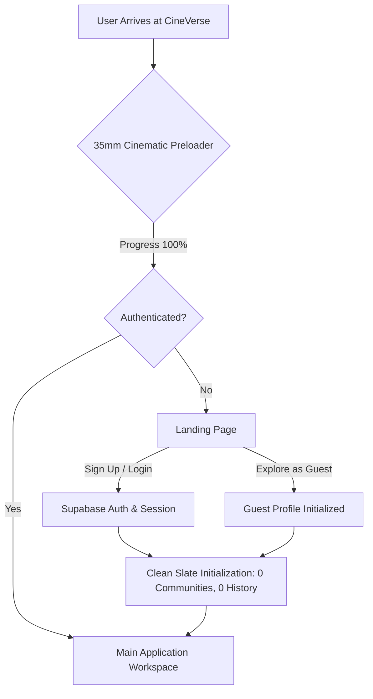
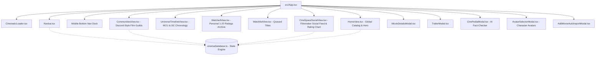
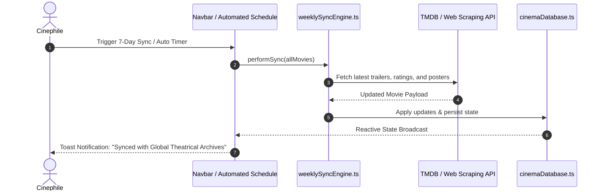

# 🎬 CINEVERSE — The Global Cinema, Superhero Multiverse & Filmmaker Social Network

<div align="center">


[](https://github.com/dipan313/CineVerse)
[](https://reactjs.org/)
[](https://www.typescriptlang.org/)
[](https://tailwindcss.com/)
[](https://supabase.com/)
[](https://ai.google.dev/)

**A next-generation cinema ecosystem bringing together Hollywood, Marvel (MCU Phases 1–6), DC Studios, Bollywood, Tollywood, and Bengali cinema into an interactive social multiverse.**

[Explore Features](#-key-features) • [Architecture & Flow](#-project-architecture--flow) • [Tech Stack](#-tech-stack) • [Installation Guide](#-getting-started)

</div>

---

## 🌟 Executive Overview

**CineVerse** reimagines how film lovers, filmmakers, and critics experience cinema online. Instead of isolated database listings, CineVerse delivers a cohesive, interactive theatrical platform featuring:

1. **Global Cinema Catalog**: Complete metadata, 4K posters, and chronological multiverse timelines covering Hollywood, Marvel (MCU Phases 1–6), DC Studios, Bollywood, Tollywood, and Bengali cinema.
2. **Discord-Style Cinema Guilds**: Community servers with dedicated text chats, audio voice-note recording, custom community creation, and synchronized Movie Theaters (supporting YouTube and local video uploads with zero auto-play).
3. **CineSpace Social Network**: A dedicated feed for directors, critics, and cinephiles to publish insights, with an exclusive **CineVerse User Rating Chart** calculated solely from verified community reactions.
4. **CinePedia AI Fact-Checker**: Real-time cinematic intelligence powered by Google Gemini and Groq (Llama 3.3 70B) constrained to film history and lore.
5. **Character Profile Avatars**: Choose authentic avatars from Iron Man, Batman, Oppenheimer, Alluri Sitarama Raju, Feluda, Byomkesh Bakshi, and more.
6. **Full Multi-Device Responsiveness**: Tailored layout with a 1-thumb Mobile Bottom Navigation Dock and adaptive community panels.

---

## 📊 Project Architecture & Flow

### 1. User Journey & Authentication Flow


---

### 2. Application Component Architecture


---

### 3. Automated 7-Day Web Sync & Scraper Engine


---

## 🚀 Key Features

### 🎬 1. 35mm Optical Cinematic Preloader (`CinematicLoader.tsx`)
- High-production studio opening featuring rotating 35mm optical projector aperture rings (24 FPS / 35mm ticks).
- Dynamic sequenced milestones: *Calibrating 4K Theatrical Registry*, *Synchronizing Multi-Industry Archives*, and *Engaging 35MM Projector*.

### 🦸‍♂️ 2. Character Profile Avatars (`AvatarSelectorModal.tsx`)
Customize your profile avatar from legendary cinematic figures across six major categories:
- **Marvel (MCU)**: Iron Man, Doctor Doom, Spider-Man, Deadpool, Captain America, Loki.
- **DC Universe**: The Batman (Bruce Wayne), The Joker (Heath Ledger), Superman (2025), Robert Pattinson's Batman.
- **Hollywood Icons**: J. Robert Oppenheimer, Dom Cobb (Inception), Joseph Cooper (Interstellar), Don Vito Corleone.
- **Tollywood / South Indian Epics**: Alluri Sitarama Raju (RRR), Komaram Bheem (RRR), Amarendra Baahubali, Rocky Bhai (KGF 2).
- **Bengali Cinema Masterworks**: Prodosh C. Mitter (Feluda / Sonar Kella), Apu (Apur Sansar / Satyajit Ray), Prabodh Roy (22 Shey Srabon).
- **Bollywood Cult Classics**: Rancho (3 Idiots), Vinayak Rao (Tumbbad), Mahavir Singh Phogat (Dangal).

### 🔍 3. Universal Search Engine (`Navbar.tsx` & `HomeView.tsx`)
- **Live Search Dropdown**: Displays instant matching movie thumbnail posters, release year, and industry for 1-click modal opening.
- **Auto-Switching Filter**: Typing in the search bar from any tab immediately switches to the Catalog and filters across titles, directors, actors, genres, and industries with a 1-click **"Clear Search"** action.

### 👥 4. Discord-Style Cinema Guilds (`CommunitiesView.tsx`)
- **Left Server Dock**: Only displays joined communities. When a user leaves a guild, it is immediately removed from their dock.
- **Discover Communities Hub**: Full-featured search and industry filters to browse and join film guilds, plus a **"+ Create Community"** wizard.
- **Channels & Lounges**:
  - `#general-chat`: Real-time discussions with pinned chat input (no outer page scroll needed).
  - `#voice-notes-lounge`: Audio recording with real `MediaRecorder` web capture and duration counters.
  - `#theater-movie-room`: Theater stream with zero auto-play — choose catalog movies, paste custom YouTube links, or upload local video files on demand.
  - `#members-directory`: View member friend codes and active badges.

### ✨ 5. CineSpace Social Network & Rating Chart (`CineSpaceSocialView.tsx`)
- Dedicated feed for filmmakers, critics, and cinephiles with role badges (*Verified Filmmaker*, *Director*, *Film Critic*, *Pro Cinephile*).
- Tag movie attachments to reviews.
- Multi-reaction bar (🔥 Fire, ❤️ Heart, 👑 Masterpiece, 🍿 Popcorn).
- **CineVerse User Rating Chart**: Real-time ranking calculated strictly from platform user reviews.

### 🤖 6. CinePedia AI Fact-Checker (`CinePediaModal.tsx` & `cinepediaEngine.ts`)
- Film fact-checker constrained strictly to cinematic trivia, plot verification, and franchise continuity.
- Supports **Google Gemini** and **Groq (Llama 3.3 70B)** API keys with a comprehensive built-in offline cinematic knowledge base.

---

## 🛠️ Tech Stack

| Domain | Technology | Purpose |
| :--- | :--- | :--- |
| **Frontend Framework** | [React 18](https://react.dev/) | Component architecture & reactive UI |
| **Language** | [TypeScript 5.5](https://www.typescriptlang.org/) | Strict type safety & movie schemas |
| **Styling** | [Tailwind CSS 3.4](https://tailwindcss.com/) | Glassmorphism, animations, and dark mode |
| **Icons** | [Lucide React](https://lucide.dev/) | Cinema, social, and control icons |
| **Build Tool** | [Vite 6](https://vitejs.dev/) | Ultra-fast HMR and optimized production bundle |
| **Backend / Auth** | [Supabase](https://supabase.com/) | PostgreSQL Authentication & persistence |
| **AI Intelligence** | [Google Gemini](https://ai.google.dev/) / [Groq](https://groq.com/) | Real-time cinematic trivia and fact-checking |
| **Audio Capture** | MediaStream / Web Audio API | Live voice note recording and playback |

---

## 📂 Project Directory Structure

```
cineverse/
├── src/
│   ├── components/
│   │   ├── AddMovieAutoImportModal.tsx   # 7-Day Web Movie Scraper & Import
│   │   ├── AvatarSelectorModal.tsx       # Character Avatar Selection Modal
│   │   ├── CinematicLoader.tsx           # 35mm Optical Preloader Animation
│   │   ├── CinePediaModal.tsx            # AI Fact-Checker Interface
│   │   ├── CineSpaceSocialView.tsx       # Filmmaker Social Feed & Rating Chart
│   │   ├── CommunitiesView.tsx           # Discord-Style Film Guilds & Theater
│   │   ├── FranchisesView.tsx            # Franchise Universe Groupings
│   │   ├── HeroCarousel.tsx              # Theatrical Spotlight Carousel
│   │   ├── HomeView.tsx                  # Global Catalog & Multi-Industry Filter
│   │   ├── LandingPage.tsx               # Cinematic Sign-In & Hero Landing
│   │   ├── LeaderboardView.tsx           # Top Cinephile Leaderboards
│   │   ├── MovieCard.tsx                 # 4K Theatrical Card with Rating Controls
│   │   ├── MovieDetailsModal.tsx         # Comprehensive Film Metadata & Cast
│   │   ├── Navbar.tsx                    # Top Bar & Mobile Bottom Navigation Dock
│   │   ├── RecommendationsSection.tsx    # Intelligent Movie Recommendation Engine
│   │   ├── ShareMovieModal.tsx           # Peer-to-Peer Movie Recommendation
│   │   ├── TrailerModal.tsx              # HD Theatrical Trailer Modal
│   │   ├── UniverseTimelineView.tsx      # Chronological MCU & DC Timelines
│   │   ├── WatchedView.tsx               # Dedicated Watched Log & Scores
│   │   └── WatchlistView.tsx             # Watchlist Queue & Management
│   ├── data/
│   │   └── allMovies.ts                  # Master Catalog (Hollywood, MCU, DC, Bollywood, Tollywood, Bengali)
│   ├── db/
│   │   ├── cinemaDatabase.ts             # Reactive State Engine & Storage Manager
│   │   └── supabaseClient.ts             # Supabase Client & AuthService
│   ├── services/
│   │   ├── cinepediaEngine.ts            # Gemini / Groq LLM Inference Service
│   │   └── weeklySyncEngine.ts           # 7-Day Automated Sync Engine
│   ├── types/
│   │   └── movie.ts                      # Core TypeScript Interfaces & Types
│   ├── App.tsx                           # Master Root Component
│   ├── main.tsx                          # Application Entry Point
│   └── index.css                         # Custom Glassmorphism & Cinema Theme
├── public/                               # Static Assets
├── package.json                          # Dependencies & NPM Scripts
├── tsconfig.json                         # TypeScript Compiler Configuration
├── vite.config.ts                        # Vite Configuration
└── README.md                             # Project Documentation
```

---

## 💻 Getting Started

### Prerequisites
- [Node.js](https://nodejs.org/) (version 18.0.0 or higher)
- [npm](https://www.npmjs.com/) (version 9.0.0 or higher)

### 1. Clone the Repository
```bash
git clone https://github.com/dipan313/CineVerse.git
cd CineVerse
```

### 2. Install Dependencies
```bash
npm install
```

### 3. Configure Environment (Optional)
To enable real-time AI fact-checking with live LLM engines, add your API keys in `.env`:
```env
VITE_GEMINI_API_KEY=your_google_gemini_api_key
VITE_GROQ_API_KEY=your_groq_api_key
```
*(Note: CinePedia AI also includes a comprehensive built-in offline fallback database if no API keys are provided).*

### 4. Run Development Server
```bash
npm run dev
```
Open your browser and navigate to `http://localhost:5173`.

### 5. Build for Production
```bash
npm run build
```

---

## 📱 Multi-Device Support

| Screen Size | Layout Adaptations |
| :--- | :--- |
| **Mobile (< 640px)** | • Fixed Frosted-Glass Bottom Navigation Dock<br>• Expandable Mobile Search Bar<br>• Adaptive Community Pane Switcher (`← Channels`) |
| **Tablet (640px - 1024px)** | • 3-4 Column Movie Card Grid<br>• Stacking CineSpace Social Feed<br>• Touch-Friendly Reaction Pills |
| **Desktop (1024px+)** | • Full Top Navigation Header with Instant Search Dropdown<br>• 3-Column Discord Cinema Guild Servers<br>• Side-by-side Rating Charts |

---

## 📜 License
This project is open-source and licensed under the **MIT License**.

---

<div align="center">

**Built with passion for true cinephiles worldwide.**

[Back to Top ↑](#-cineverse--the-global-cinema-superhero-multiverse--filmmaker-social-network)

</div>
